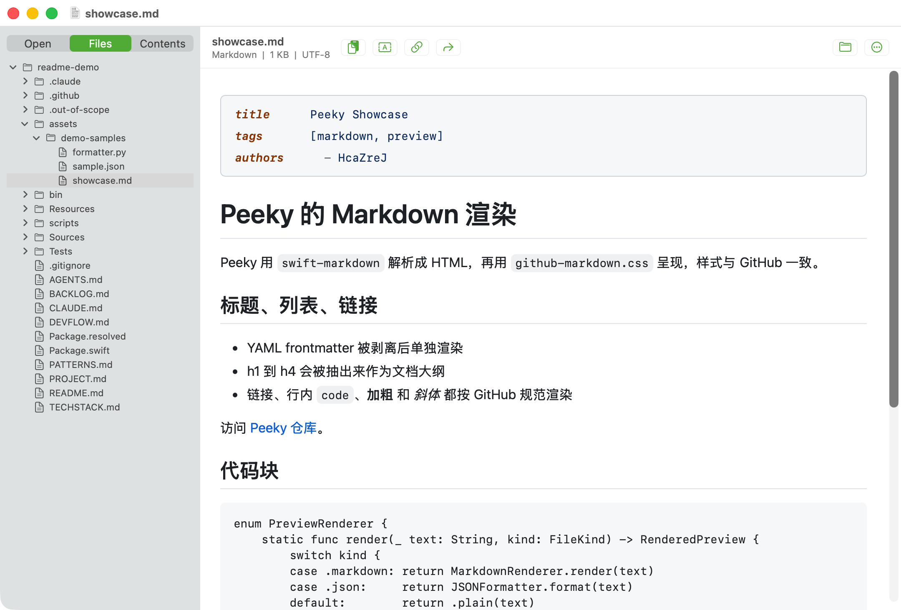
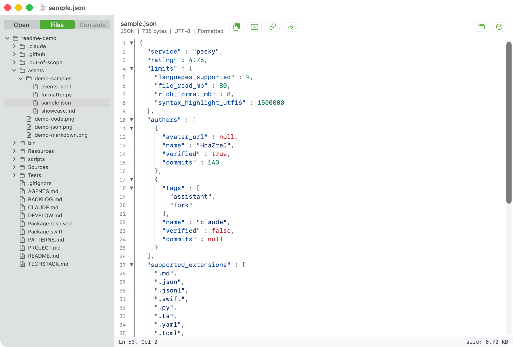
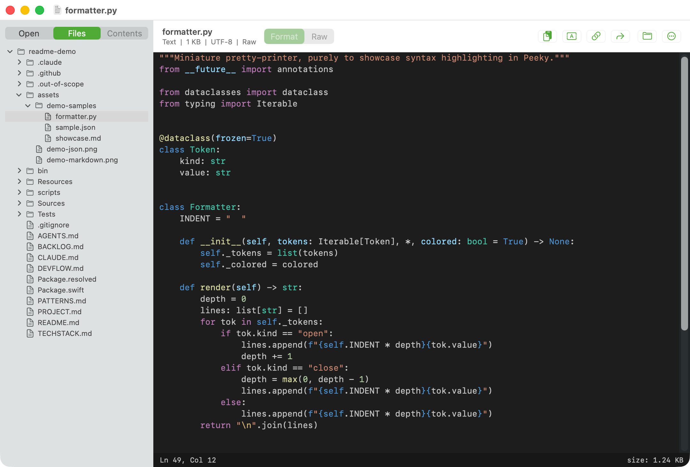
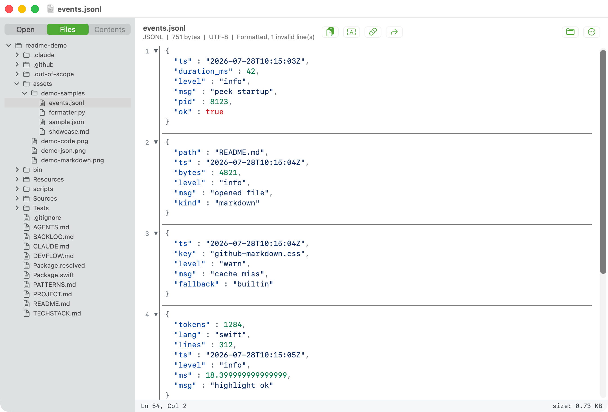

# Peeky

Peeky 是 macOS 上的只读文件预览器，解决用 IDE 打开 AI 产出的文件冷启动太慢的问题。可以从终端 `peek filename` 光速打开文件。

|  |  |
|---|---|
|  |  |
|  |  |

## 功能

- 从终端 `peek path`、`peek path:line`、`peek path:line:col` 打开文件并跳到指定行、指定列。
- Markdown 用 swift-markdown 解析成 HTML，在 WKWebView 中以 github-markdown.css 呈现，样式与 GitHub 一致；解析 YAML frontmatter 并单独渲染，提取 h1–h4 作为文档大纲。
- JSON 与 JSONL 缩进格式化，对键、字符串、数字、布尔、null、标点做词法高亮；JSONL 解析失败的行原样保留并标出。
- 源码语法高亮，覆盖 9 种语言，主题为 VS Code Dark Modern。
- XML 与 plist 缩进格式化后显示。
- 提供 `peeky://` URL scheme，供终端 OSC 8 超链接调用。
- 三条内容上限：文件读取 80 MB、富格式化 8 MB、语法高亮 1.5M UTF-16 字符。
- 需要 macOS 13 或更高版本；仓库仅有一个第三方 SPM 依赖 `swift-markdown`。

## 安装

前置条件：macOS 13 或更高版本。

### Homebrew（推荐，自带 `peek` 命令）

```sh
brew tap HcaZreJ/peeky
brew install --cask peeky
```

装完 `Peeky.app` 在 `/Applications`，`peek` 命令自动进 PATH。终端里 `peek foo.md` 立刻可用。

### GitHub Release 下载 zip

去 [Releases](https://github.com/HcaZreJ/Peeky/releases) 下载最新的 `Peeky-vX.Y.Z.zip`，解压后把 `Peeky.app` 拖到 `/Applications`。

首次打开会弹"无法验证开发者"——Peeky 是 ad-hoc 签名，苹果没扫过。放行步骤：

1. 弹窗上点"取消"或"完成"
2. 打开 系统设置 → 隐私与安全性
3. 滚到底部，会看到一行"已阻止 Peeky.app，因为无法验证开发者"
4. 点旁边的"仍要打开"，输密码/Touch ID
5. 再双击 `Peeky.app` 就正常打开，以后不再需要放行

这个渠道不含 `peek` 命令；需要终端 `peek path` 的话走上面的 Homebrew 路径。

### 从源码构建（开发者）

```sh
bash scripts/build-app.sh --install
```

前置需要 Swift toolchain（Xcode 或 Command Line Tools）。该命令做两件事：把 `.build/Peeky.app` 复制到 `~/Applications/Peeky.app`；把 bundle 里的 `peek` 通过 symlink 链接到 `~/.local/bin/peek`。

只构建、不安装：

```sh
bash scripts/build-app.sh
```

产物位置：`.build/Peeky.app`。

## 用法

### 命令行

```sh
peek                       # 打开当前目录
peek path/to/file          # 打开单个文件
peek path/to/file:12       # 打开并跳到第 12 行
peek path/to/file:12:8     # 跳到第 12 行第 8 列
peek a.md b.jsonl          # 同时打开多个文件，每个文件占一个标签页
```

行号和列号必须为正整数（正则 `[1-9][0-9]*`）。路径支持 `~` 展开。

### `peeky://` URL scheme

```
peeky://open?path=<absolute>&line=<n>&column=<n>
peeky://open?path=<relative>&cwd=<base>&line=<n>
peeky://open?url=file:///abs/path
peeky:///abs/path?line=<n>
```

参数：

| 参数 | 说明 |
|---|---|
| `url` | file URL；提供后其它路径参数被忽略 |
| `path` | 绝对路径或相对路径 |
| `cwd` | `path` 为相对路径时的基准目录 |
| `line`（别名 `row`） | 正整数，跳转行号 |
| `column`（别名 `col`） | 正整数，跳转列号 |

### 终端 OSC 8 超链接

Ghostty 等支持 OSC 8 的终端可以把 `path:line` 变成可点链接，点击后调用 `peeky://` 打开 Peeky：

```sh
file="$PWD/logs/app.jsonl"
line=42
label="logs/app.jsonl:$line"
encoded="$(python3 -c 'import sys, urllib.parse; print(urllib.parse.quote(sys.argv[1]))' "$file")"
printf '\e]8;;peeky://open?path=%s&line=%s\a%s\e]8;;\a\n' "$encoded" "$line" "$label"
```

### Finder「打开方式」与拖入

Peeky.app 在 Info.plist 中注册为下列文件类型的查看器（`LSHandlerRank = Alternate`）：

- `public.plain-text`
- `public.text`
- `public.source-code`
- `public.json`
- `net.daringfireball.markdown`
- `com.peeky.jsonlines`（自定义 UTI，扩展名 `.jsonl` 和 `.ndjson`）

在 Finder 里通过「打开方式」选 Peeky，或把文件拖到 Peeky 图标即可打开。

## 支持的文件格式

| 格式 | 扩展名 | 处理方式 |
|---|---|---|
| Markdown | `.md` `.markdown` `.mdown` `.mkd` | swift-markdown 解析成 HTML，WKWebView + github-markdown.css 渲染；提取 h1–h4 作为大纲；YAML frontmatter 剥离后单独渲染 |
| JSON | `.json` | `JSONSerialization` 缩进格式化，对键、字符串、数字、bool、null、标点做词法高亮；解析失败标注 "Invalid JSON" 并保留原文 |
| JSONL | `.jsonl` `.ndjson` | 逐行格式化；解析失败的行原样保留并标出 |
| YAML | `.yaml` `.yml` | 原文显示，shiki 语法高亮 |
| XML | `.xml` | `XMLDocument` 缩进格式化，正则语法高亮 |
| plist | `.plist` | 反序列化后以 XML 格式序列化输出，正则语法高亮；解析失败降级为等宽原文 |
| CSV / TSV | `.csv` `.tsv` | 等宽原文显示 |
| Log | `.log` | 等宽原文显示 |
| 其它文本 | 任意 | 等宽原文；文件内容以 `{`、`[` 起始时按 JSON 处理，以 `<` 起始时按 XML 处理 |

超过 80 MB 的文件只读取前 80 MB，并标注为 truncated。

## 语法高亮

高亮引擎是 JavaScriptCore + shiki，产物 `Sources/PeekyKit/Resources/shiki-bundle.js` 已 checked-in，运行期不依赖 Node。

打包的语言与扩展名映射：

| Shiki 语言 | 扩展名 |
|---|---|
| python | `.py` |
| typescript | `.ts` |
| javascript | `.js` `.mjs` `.cjs` |
| json | `.json` |
| yaml | `.yaml` `.yml` |
| toml | `.toml` |
| bash | `.sh` `.bash` `.zsh` |
| swift | `.swift` |
| ini | `.ini` `.conf` `.config` |

主题：VS Code Dark Modern（`dark_modern` 的 include 链在构建期扁平化后内嵌进 bundle）。

超过 1.5M UTF-16 字符的文件跳过高亮，直接显示等宽原文。JSON / JSONL 超过 8 MB 富格式化上限时仍然进行缩进格式化，靠可视区惰性高亮处理大文件。

## 从源码构建

```sh
swift build                          # debug
swift build -c release               # release
swift run Peeky path/to/file         # 直接运行
bash scripts/build-app.sh            # 组装 .build/Peeky.app（ad-hoc codesign）
bash scripts/build-app.sh --install  # 组装并安装到 ~/Applications、~/.local/bin
```

重新生成 shiki bundle（改语言或主题后需要运行）：

```sh
node scripts/build-shiki-bundle.mjs
```

Node ≥ 22。产物 `Sources/PeekyKit/Resources/shiki-bundle.js` 已 checked-in，通常不需要重新构建。

运行测试：

```sh
swift build --product PeekyTests && ./.build/debug/PeekyTests
```

## 仓库结构

```
Sources/Peeky/                    入口 main.swift
Sources/PeekyKit/                 全部实现：渲染管线、格式化器、AppKit 控制器
Sources/PeekyKit/Resources/       shiki-bundle.js、github-markdown.css
Resources/                        Info.plist（peeky:// scheme + UTI）、图标
bin/peek                          shell 包装，把参数编码成 peeky:// URL 后 open
scripts/build-app.sh              release 构建 + .app 组装 + 可选安装
scripts/build-shiki-bundle.mjs    esbuild 生成 shiki bundle
scripts/shiki-bundle/             shiki bundle 的 npm 源工程
Tests/                            visible/ 与 hidden/ 双层测试
```

## 致谢

Peeky fork 自 [zhangzhejian/Peeky](https://github.com/zhangzhejian/Peeky)（口头授权）。
